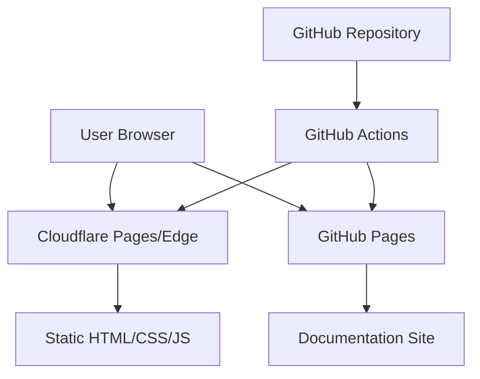
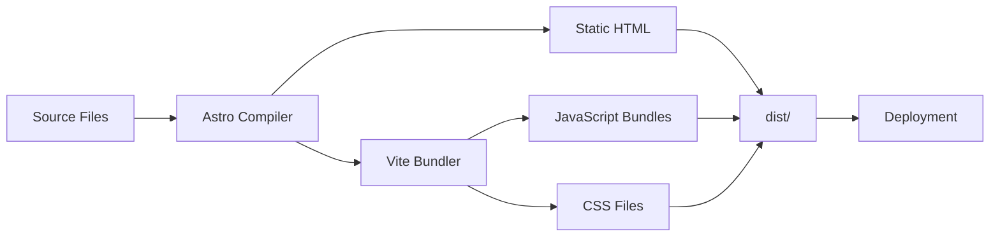
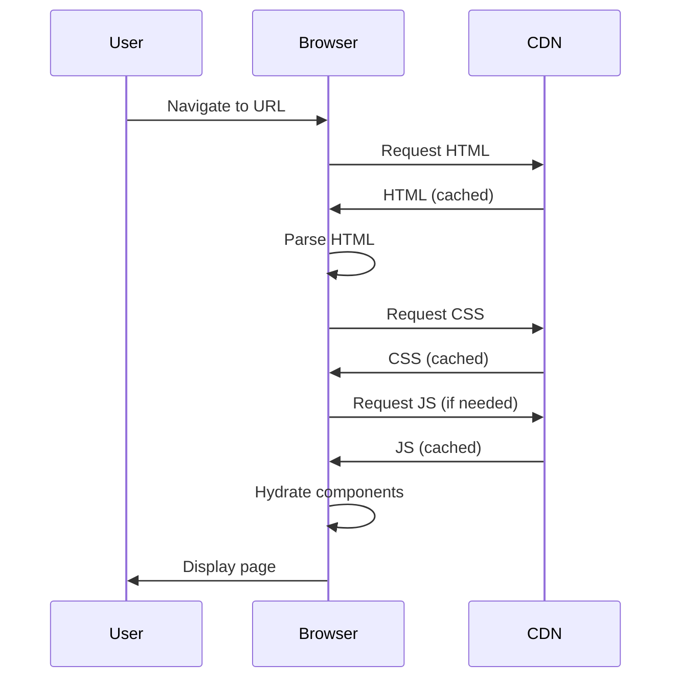
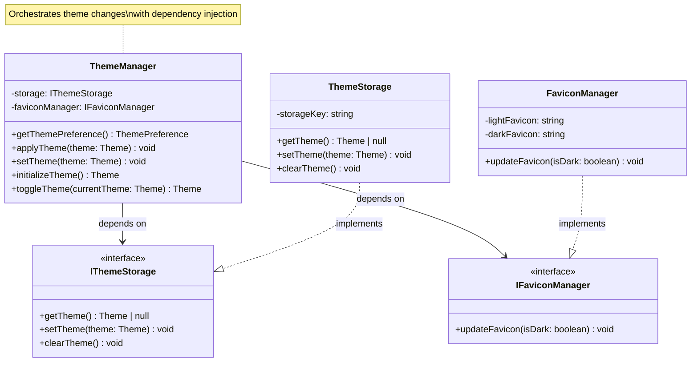
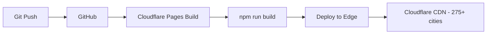
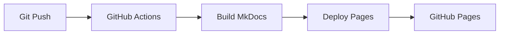

# Architecture Overview

Understanding the system design and architecture.

## System Context

Static website built with modern web technologies, deployed to CDN edge networks for optimal performance.



## Architecture Principles

### 1. Static-First

**Benefits:**

- No server required - infinite scalability
- Excellent performance - pre-rendered HTML
- Low cost - free tier deployments

**Trade-offs:**

- No dynamic server logic
- Content updates require rebuild

### 2. Island Architecture

Interactive components are isolated "islands" of interactivity in a static sea:

```astro
---
// Server-rendered (zero JS)
---

<div>
  <h1>Static Content</h1>

  <!-- Island: Interactive component -->
  <ThemeToggle client:idle />

  <p>More static content</p>
</div>
```

**Hydration Strategies:**

- `client:idle` - Load when browser is idle (ThemeToggle)
- `client:visible` - Load when component enters viewport (PlantUMLDiagram)

### 3. Component-Based

React components for reusable UI:

```
src/components/
 ThemeToggle.tsx      # Dark mode toggle
 TechStack.tsx        # Tech stack display
 CodeBlock.tsx        # Syntax highlighting
 PlantUMLDiagram.tsx  # PlantUML diagrams
 AnimatedGrid.tsx     # Animated backgrounds
```

### 4. File-Based Routing

Pages auto-route based on file structure:

```
src/pages/
 index.astro          /
 about.astro          /about
 projects.astro       /projects
 architecture.astro   /architecture
 contact.astro        /contact
 404.astro           404 error
```

## System Design

### Build Process



### Data Flow



## Component Architecture

### Layout System

```
src/layouts/
 Layout.astro       # Base layout
     <head>         # Meta tags, styles
     <nav>          # Navigation with ThemeToggle
     <main>         # Page content slot
     <footer>       # Footer
```

### Styling Architecture

Tailwind CSS 4 with custom theme:

```css
/* global.css */
@import 'tailwindcss';

@theme {
  --color-accent: oklch(70% 0.2 250);
  --font-sans: system-ui, -apple-system, sans-serif;
}

@variant dark (&:where(.dark, .dark *));
```

## State Management

### Client-Side State

React components use hooks:

```tsx
import { useState, useEffect } from 'react';

export default function Component() {
  const [theme, setTheme] = useState('light');

  useEffect(() => {
    const stored = localStorage.getItem('theme');
    if (stored) setTheme(stored);
  }, []);

  return <button onClick={() => setTheme('dark')}>Toggle</button>;
}
```

## Build Architecture

### Astro + Vite Configuration

```javascript
// astro.config.mjs
export default defineConfig({
  site: 'https://chrislyons.dev',
  integrations: [react(), sitemap()],
  vite: {
    plugins: [tailwindcss()],
    build: {
      cssMinify: 'lightningcss',
    },
  },
});
```

### Output Structure

```
dist/
 index.html
 404.html
 about/index.html
 architecture/index.html
 contact/index.html
 projects/index.html
 _astro/
     [hash].css
     [hash].js
```

## C4 Architecture Model

Architecture diagrams follow the C4 model and are automatically generated in CI/CD.

### Level 1: System Context

The big picturehow the portfolio site fits into the broader ecosystem.


[View PlantUML Source](generated/c4-system-context.puml) | [View SVG](generated/c4-system-context.svg)

**Generated from**: GitHub Actions workflows, wrangler.toml, package.json

---

### Level 2: Container Diagram

Major technical containers (applications, data stores, microservices).


[View PlantUML Source](generated/c4-container.puml) | [View SVG](generated/c4-container.svg)

**Generated from**: package.json dependencies, astro.config.mjs, build configuration

---

### Level 3: Component Diagram

Major components and their interactions.


[View PlantUML Source](generated/c4-component.puml) | [View SVG](generated/c4-component.svg)

**Generated from**: Source code structure analysis (src/pages, src/components, src/services)

---

### Level 4: Code Diagram - Theme Management

The theme management system demonstrates dependency injection and separation of concerns.



**Key Design Patterns:**

- **Dependency Injection**: ThemeManager depends on interfaces
- **Single Responsibility**: Each class has one purpose
- **Singleton Pattern**: Storage and favicon managers are singletons

**Generated from**: AST analysis of `src/services/ThemeManager.ts`, `ThemeStorage.ts`, `FaviconManager.ts`

---

## Generated Diagrams

### Module Dependencies


[View Source](generated/module-dependencies.mmd)

### Routes Map


[View Source](generated/routes-map.mmd)

## Deployment Architecture

### Cloudflare Pages (Primary)



### GitHub Pages (Docs)



## Security Architecture

- Static content (no user input, no database)
- No server-side code - minimal attack surface
- CDN-level DDoS protection
- Automated security scanning in CI

## Performance Architecture

### Optimization Layers

1. **Build Time**: Minification, tree-shaking
2. **CDN Layer**: Edge caching, compression
3. **Browser**: Lazy loading, code splitting
4. **Runtime**: Island hydration on-demand

### Caching Strategy

```
HTML:         5 minutes (stale-while-revalidate)
CSS/JS:       1 year (immutable, content-hashed)
Images:       1 year (immutable)
Fonts:        1 year (immutable)
```

## Next Steps

- [System Design Details](system-design.md)
- [Dependencies](dependencies.md)
- [Deployment Guide](../deployment/overview.md)
