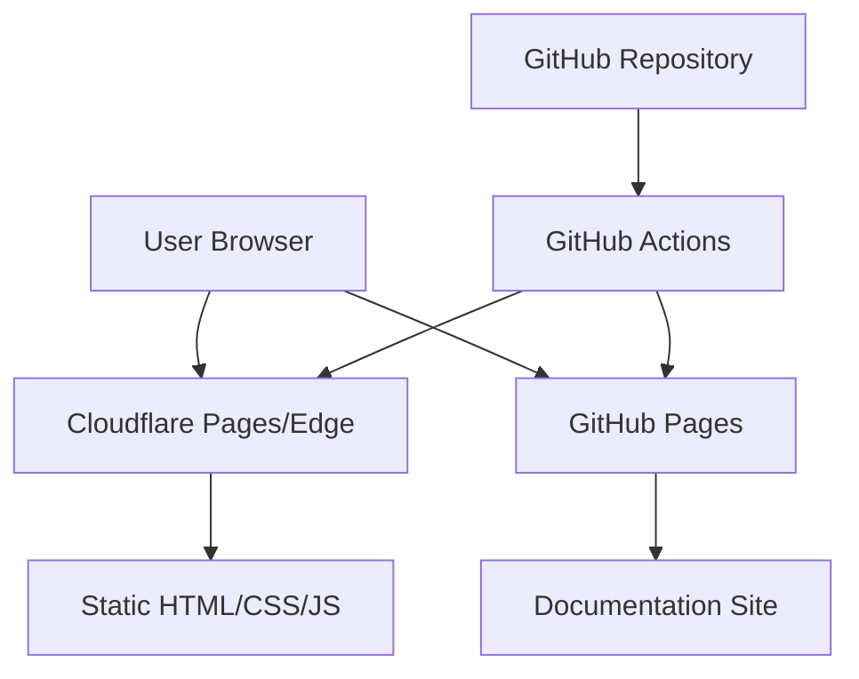
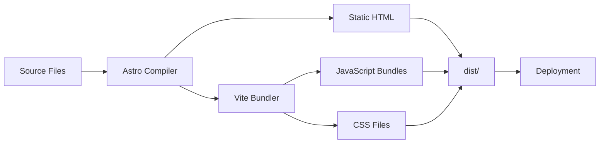
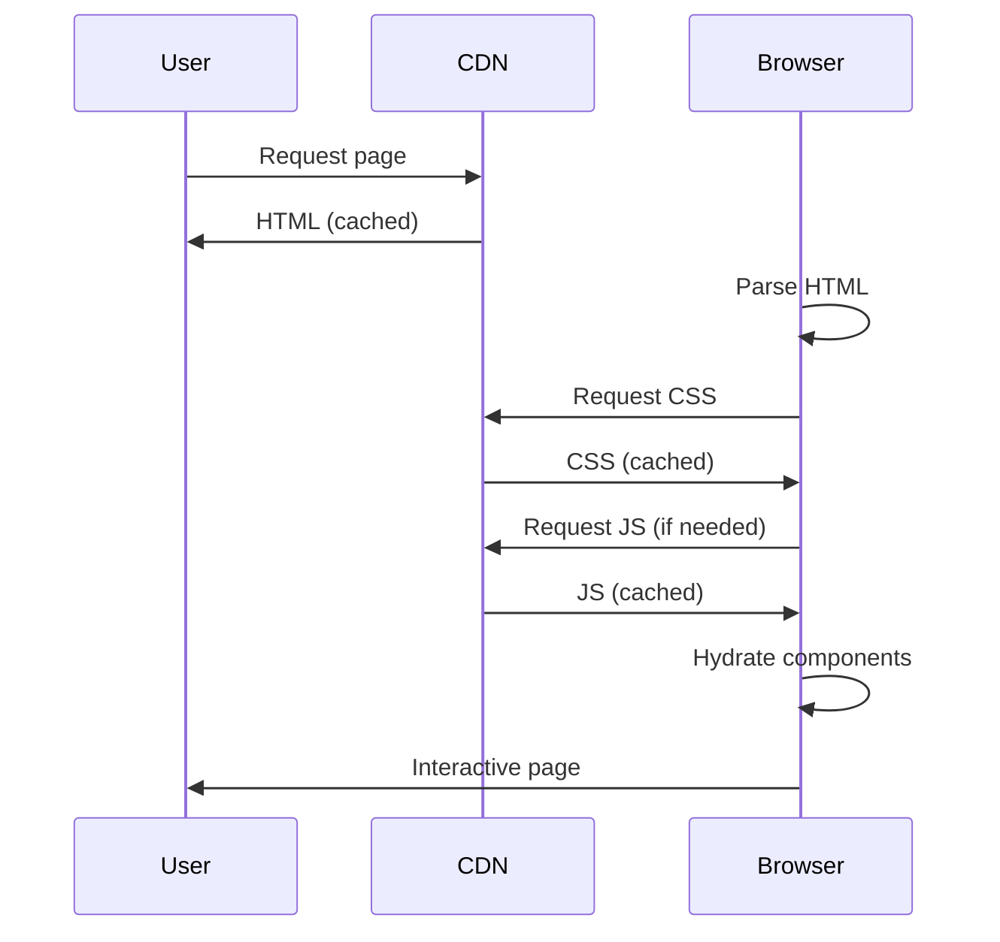
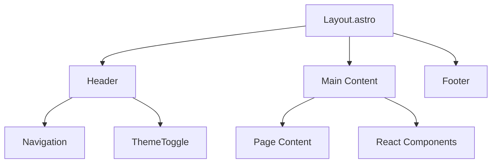

# Architecture Overview

Understanding the system design and architecture.

## System Context

This is a static website built with modern web technologies, focusing on performance and developer experience.



## Architecture Principles

### 1. Static-First

**Benefits:**
- No server required
- Infinite scalability
- Excellent performance
- Low cost

**Trade-offs:**
- No dynamic server logic
- Build-time data fetching
- Content updates require rebuild

### 2. Island Architecture

Interactive components are isolated "islands":

```astro
---
// Server-rendered (zero JS)
---

<div>
  <h1>Static Content</h1>

  <!-- Island: Interactive component -->
  <ThemeToggle client:load />

  <p>More static content</p>
</div>
```

**Hydration Strategies:**
- `client:load` - Load immediately
- `client:idle` - Load when idle
- `client:visible` - Load when in viewport

### 3. Component-Based

React components for reusable UI:

```
src/components/
├── ThemeToggle.tsx    # Dark mode toggle
├── TechStack.tsx      # Tech stack display
├── CodeBlock.tsx      # Syntax highlighting
└── Navigation.tsx     # Site navigation
```

### 4. File-Based Routing

Pages auto-route based on file structure:

```
src/pages/
├── index.astro        → /
├── about.astro        → /about
├── projects.astro     → /projects
└── blog/
    └── [slug].astro   → /blog/*
```

## System Design

### Build Process



### Data Flow



## Component Architecture

### Layout System

```
src/layouts/
└── Layout.astro       # Base layout
    ├── <head>         # Meta tags, styles
    ├── <Header>       # Site header
    ├── <main>         # Page content
    └── <Footer>       # Site footer
```

### Component Hierarchy



## Styling Architecture

### Tailwind CSS 4.x

```css
/* global.css */
@import "tailwindcss";

/* Theme variables */
@theme {
  --color-primary: oklch(0.5 0.2 250);
  --color-bg: oklch(0.1 0 0);
}

/* Custom utilities */
@layer utilities {
  .text-balance {
    text-wrap: balance;
  }
}
```

### CSS Layers

```
@layer base          # Base styles, resets
@layer components    # Component styles
@layer utilities     # Utility classes
```

## State Management

### Client-Side State

React components use hooks:

```tsx
import { useState, useEffect } from 'react';

export default function Component() {
  const [theme, setTheme] = useState('light');

  useEffect(() => {
    const stored = localStorage.getItem('theme');
    if (stored) setTheme(stored);
  }, []);

  return <button onClick={() => setTheme('dark')}>Toggle</button>;
}
```

### Global State

Shared via context or localStorage:

```tsx
import { createContext, useContext } from 'react';

const ThemeContext = createContext('light');

export function ThemeProvider({ children }) {
  return (
    <ThemeContext.Provider value={theme}>
      {children}
    </ThemeContext.Provider>
  );
}
```

## Build Architecture

### Vite Configuration

```javascript
export default {
  build: {
    rollupOptions: {
      output: {
        manualChunks: {
          'react-vendor': ['react', 'react-dom'],
        },
      },
    },
  },
};
```

### Output Structure

```
dist/
├── index.html
├── about.html
├── _astro/
│   ├── [hash].css
│   └── [hash].js
└── assets/
    └── [optimized images]
```

## Generated Architecture Diagrams

All architecture diagrams are automatically generated and rendered as part of the CI/CD pipeline.

### Module Dependencies

View the module dependency graph:


[View Source](generated/module-dependencies.mmd) | [View DOT](generated/dependencies.dot)

### Routes Map

Application routes structure:


[View Source](generated/routes-map.mmd) | [View JSON](generated/routes.json)

### C4 System Context


[View PlantUML Source](generated/c4-system-context.puml)

### C4 Container Diagram


[View PlantUML Source](generated/c4-container.puml)

## Deployment Architecture

### Cloudflare Pages (Primary)


### GitHub Pages (Docs)


## Security Architecture

### Content Security

- Static content (no user input)
- No server-side code
- No database
- CDN-level DDoS protection

### Build Security

- Dependabot updates
- npm audit in CI
- Commit signing
- Branch protection

## Performance Architecture

### Optimization Layers

1. **Build Time**: Minification, tree-shaking
2. **CDN Layer**: Edge caching, compression
3. **Browser**: Service workers, cache API
4. **Runtime**: Lazy loading, code splitting

### Caching Strategy

```
HTML:         5 minutes
CSS/JS:       1 year (immutable)
Images:       1 year (immutable)
Fonts:        1 year (immutable)
```

## Next Steps

- [System Design Details](system-design.md)
- [Dependencies](dependencies.md)
- [Deployment Guide](../deployment/overview.md)
