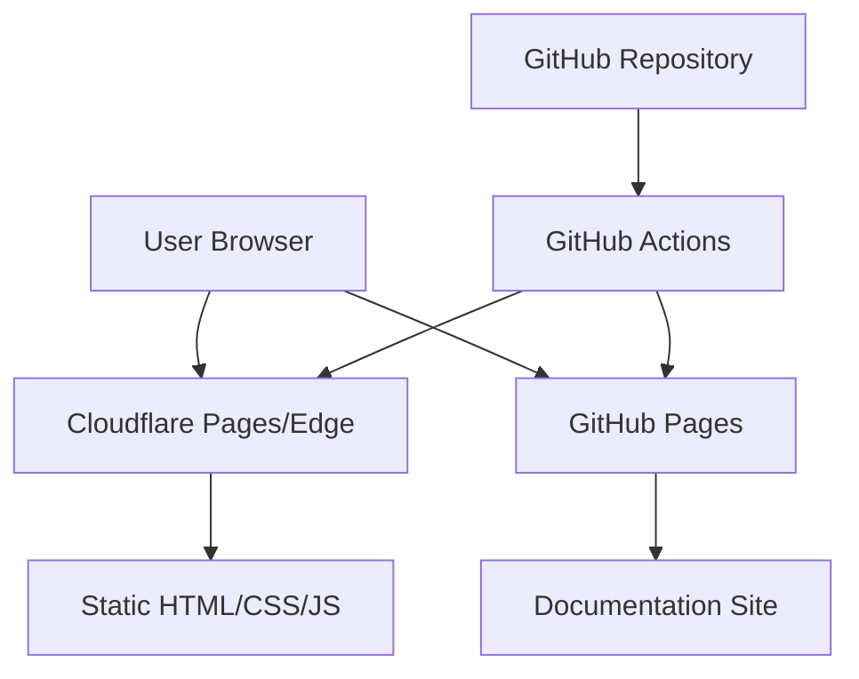
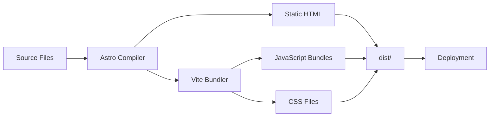
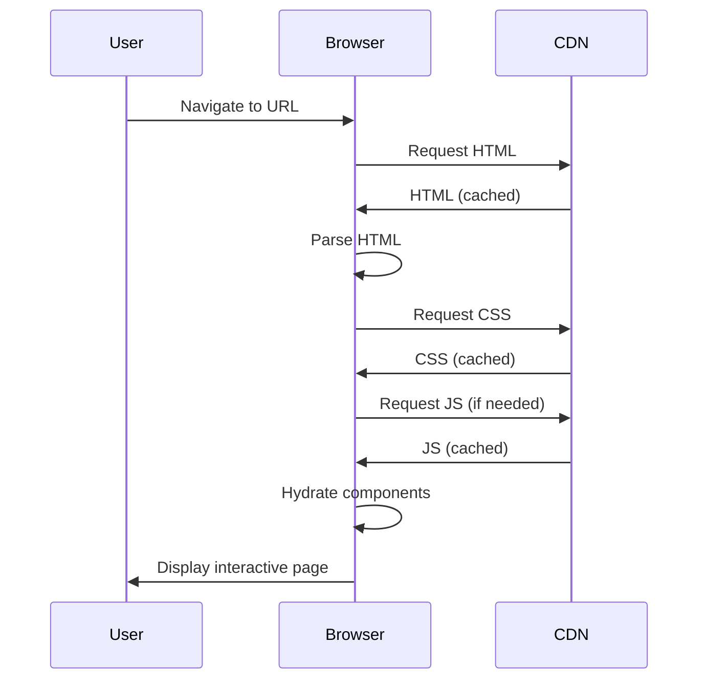
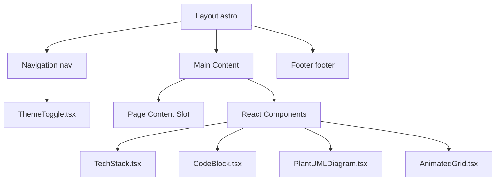
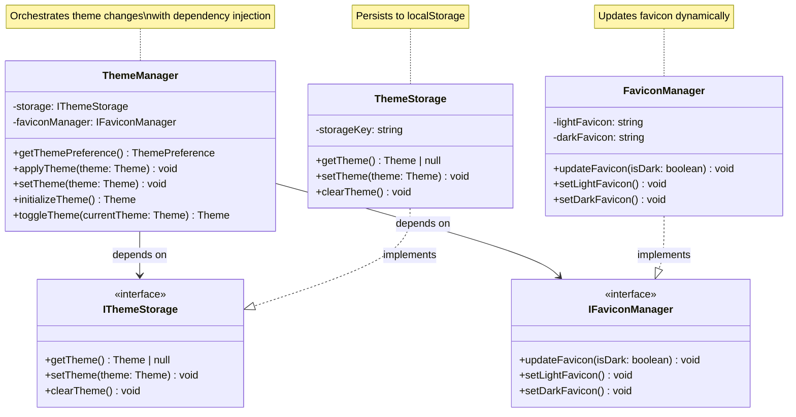
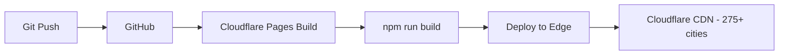
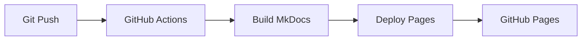

# Architecture Overview

Understanding the system design and architecture.

## System Context

This is a static website built with modern web technologies, focusing on performance and developer experience.



## Architecture Principles

### 1. Static-First

**Benefits:**

- No server required
- Infinite scalability
- Excellent performance
- Low cost

**Trade-offs:**

- No dynamic server logic
- Build-time data fetching
- Content updates require rebuild

### 2. Island Architecture

Interactive components are isolated "islands":

```astro
---
// Server-rendered (zero JS)
---

<div>
  <h1>Static Content</h1>

  <!-- Island: Interactive component -->
  <ThemeToggle client:idle />

  <p>More static content</p>
</div>
```

**Hydration Strategies Used:**

- `client:idle` - Load when browser is idle (used for ThemeToggle)
- `client:visible` - Load when component enters viewport (used for PlantUMLDiagram)

### 3. Component-Based

React components for reusable UI:

```
src/components/
├── ThemeToggle.tsx      # Dark mode toggle
├── TechStack.tsx        # Tech stack display
├── CodeBlock.tsx        # Syntax highlighting
├── PlantUMLDiagram.tsx  # PlantUML diagram rendering
└── AnimatedGrid.tsx     # Animated background grid
```

### 4. File-Based Routing

Pages auto-route based on file structure:

```
src/pages/
├── index.astro         → /
├── about.astro         → /about
├── projects.astro      → /projects
├── architecture.astro  → /architecture
├── contact.astro       → /contact
└── 404.astro          → 404 error page
```

## System Design

### Build Process



### Data Flow



## Component Architecture

### Layout System

```
src/layouts/
└── Layout.astro       # Base layout
    ├── <head>         # Meta tags, styles
    ├── <nav>          # Inline navigation with ThemeToggle
    ├── <main>         # Page content slot
    └── <footer>       # Inline footer
```

### Component Hierarchy



## Styling Architecture

### Tailwind CSS 4.x

```css
/* global.css */
@import "tailwindcss";

/* Theme variables */
@theme {
  --color-accent: oklch(70% 0.2 250);
  --color-accent-dark: oklch(60% 0.2 250);
  --font-sans: system-ui, ...;
  --font-mono: ui-monospace, ...;
}

/* Dark mode variants */
@variant dark (&:where(.dark, .dark *));

/* Responsive color scheme */
@media (prefers-color-scheme: dark) {
  :root {
    --color-bg: oklch(15% 0.01 250);
    --color-text: oklch(95% 0.01 250);
  }
}
```

## State Management

### Client-Side State

React components use hooks:

```tsx
import { useState, useEffect } from "react";

export default function Component() {
  const [theme, setTheme] = useState("light");

  useEffect(() => {
    const stored = localStorage.getItem("theme");
    if (stored) setTheme(stored);
  }, []);

  return <button onClick={() => setTheme("dark")}>Toggle</button>;
}
```

### Global State

Shared via context or localStorage:

```tsx
import { createContext, useContext } from "react";

const ThemeContext = createContext("light");

export function ThemeProvider({ children }) {
  return (
    <ThemeContext.Provider value={theme}>{children}</ThemeContext.Provider>
  );
}
```

## Build Architecture

### Astro + Vite Configuration

```javascript
// astro.config.mjs
export default defineConfig({
  site: 'https://chrislyons.dev',
  integrations: [react(), sitemap()],

  vite: {
    plugins: [tailwindcss()],
    build: {
      cssMinify: 'lightningcss',
    }
  }
});
```

### Output Structure

```
dist/
├── index.html
├── 404.html
├── about/
│   └── index.html
├── architecture/
│   └── index.html
├── contact/
│   └── index.html
├── projects/
│   └── index.html
└── _astro/
    ├── [hash].css
    └── [hash].js
```

## C4 Architecture Model

All architecture diagrams follow the C4 model (Levels 1-4) and are automatically generated as part of the CI/CD pipeline.

### Level 1: System Context

The big picture—showing how the portfolio site fits into the broader ecosystem of external systems and users.


[View PlantUML Source](generated/c4-system-context.puml) | [View SVG](generated/c4-system-context.svg)

**Generated from**: GitHub Actions workflows (cd.yml, ci.yml), wrangler.toml, package.json

---

### Level 2: Container Diagram

Zooming into the system to show the major technical containers (applications, data stores, microservices).


[View PlantUML Source](generated/c4-container.puml) | [View SVG](generated/c4-container.svg)

**Generated from**: package.json dependencies, astro.config.mjs, build configuration

---

### Level 3: Component Diagram

Zooming into a container to show the major components and their interactions.


[View PlantUML Source](generated/c4-component.puml) | [View SVG](generated/c4-component.svg)

**Generated from**: Source code structure analysis (src/pages, src/components, src/services)

---

### Level 4: Code Diagram (Selective)

> **Note**: Level 4 diagrams are optional. They're great for critical algorithms, security components, or complex business logic that needs detailed documentation. But avoid generating them for entire systems—they quickly become overwhelming and unmaintainable at scale.

#### Theme Management System

The theme management system demonstrates dependency injection and separation of concerns—a critical component for user experience consistency across the site.



**Key Design Patterns:**
- **Dependency Injection**: ThemeManager depends on interfaces, not concrete implementations
- **Single Responsibility**: Each class has one clear purpose
- **Singleton Pattern**: Storage and favicon managers are singleton instances

**Generated from**: AST analysis of `src/services/ThemeManager.ts`, `ThemeStorage.ts`, `FaviconManager.ts`

---

## Additional Generated Diagrams

### Module Dependencies

View the module dependency graph:



[View Source](generated/module-dependencies.mmd) | [View DOT](generated/dependencies.dot)

### Routes Map

Application routes structure:



[View Source](generated/routes-map.mmd) | [View JSON](generated/routes.json)

## Deployment Architecture

### Cloudflare Pages (Primary)



### GitHub Pages (Docs)



## Security Architecture

### Content Security

- Static content (no user input)
- No server-side code
- No database
- CDN-level DDoS protection

### Build Security

- Automated CI/CD pipeline
- GitHub Actions security scanning
- Static site architecture (minimal attack surface)

## Performance Architecture

### Optimization Layers

1. **Build Time**: Minification, tree-shaking
2. **CDN Layer**: Edge caching, compression
3. **Browser**: Service workers, cache API
4. **Runtime**: Lazy loading, code splitting

### Caching Strategy

```
HTML:         5 minutes
CSS/JS:       1 year (immutable)
Images:       1 year (immutable)
Fonts:        1 year (immutable)
```

## Next Steps

- [System Design Details](system-design.md)
- [Dependencies](dependencies.md)
- [Deployment Guide](../deployment/overview.md)
