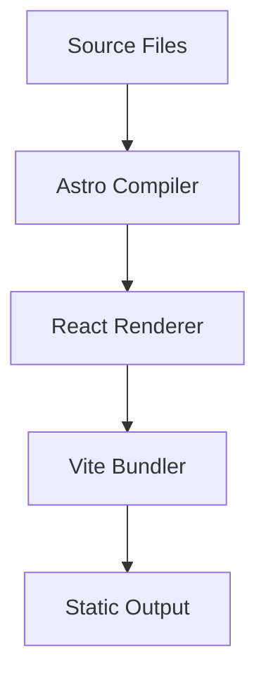
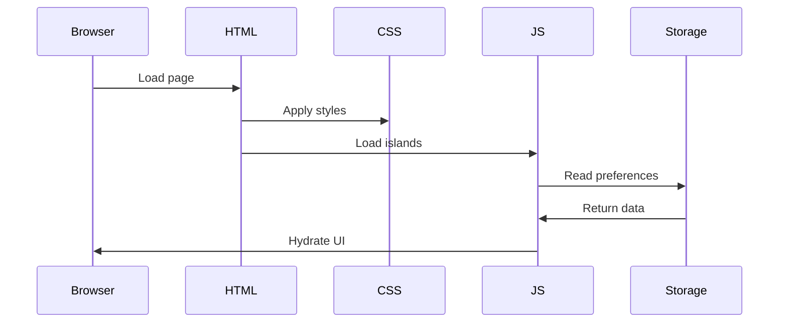

# System Design

Detailed system design and architecture decisions.

## High-Level Architecture

### C4 Model - System Context

```plantuml
@startuml
!include https://raw.githubusercontent.com/plantuml-stdlib/C4-PlantUML/master/C4_Context.puml

Person(user, "Website Visitor", "Someone interested in Chris Lyons' work")
System(website, "Personal Website", "Static website showcasing portfolio and projects")
System_Ext(cloudflare, "Cloudflare Pages", "Global edge network and CDN")
System_Ext(github, "GitHub Pages", "Documentation hosting")

Rel(user, website, "Visits", "HTTPS")
Rel(website, cloudflare, "Hosted on")
Rel(website, github, "Docs hosted on")
@enduml
```

### C4 Model - Container View

```plantuml
@startuml
!include https://raw.githubusercontent.com/plantuml-stdlib/C4-PlantUML/master/C4_Container.puml

Person(user, "Visitor")

Container(html, "Static HTML", "Astro", "Pre-rendered pages")
Container(js, "JavaScript", "React", "Interactive components")
Container(css, "Stylesheets", "Tailwind", "Responsive styles")
Container(assets, "Assets", "Images, Fonts", "Optimized media")

Rel(user, html, "Requests")
Rel(html, js, "Loads", "ES Modules")
Rel(html, css, "Loads", "Stylesheets")
Rel(html, assets, "Loads", "Images/Fonts")
@enduml
```

## Design Decisions

### 1. Why Astro?

**Decision:** Use Astro as the primary framework

**Rationale:**
- Zero JavaScript by default
- Excellent for content-focused sites
- Island architecture for interactivity
- Fast build times
- Great DX

**Alternatives Considered:**
- Next.js: Too much overhead for static site
- Gatsby: Slower builds, more complex
- Jekyll: Limited modern tooling

### 2. Why React?

**Decision:** Use React for interactive components

**Rationale:**
- Familiar ecosystem
- Rich component library
- Excellent TypeScript support
- Works well with Astro islands

**Alternatives Considered:**
- Vue: Less familiar to team
- Svelte: Smaller ecosystem
- Vanilla JS: Less maintainable

### 3. Why Tailwind CSS 4?

**Decision:** Use Tailwind CSS 4 via Vite plugin

**Rationale:**
- Smaller bundle sizes
- Faster build times
- Modern CSS features
- No PostCSS required

**Alternatives Considered:**
- Styled Components: More runtime overhead
- CSS Modules: Less utility-based
- Plain CSS: Less maintainable at scale

### 4. Static Deployment

**Decision:** Deploy as static site to Cloudflare Pages

**Rationale:**
- No server costs
- Infinite scalability
- Excellent performance
- Simple deployment

**Alternatives Considered:**
- Server-side rendering: Unnecessary complexity
- Client-side rendering: Poor SEO/performance
- Hybrid: Overkill for this use case

## Module Design

### Page Architecture

```typescript
// Page structure
interface Page {
  layout: Layout;
  content: Content;
  metadata: Metadata;
}

interface Layout {
  header: Header;
  main: Main;
  footer: Footer;
}

interface Metadata {
  title: string;
  description: string;
  ogImage?: string;
}
```

### Component Design

```typescript
// Component props interface
interface ComponentProps {
  // Core props
  children?: React.ReactNode;
  className?: string;

  // Behavior
  client?: 'load' | 'idle' | 'visible';

  // Accessibility
  ariaLabel?: string;
  ariaDescribedBy?: string;
}
```

## Data Flow

### Build-Time Data Flow



### Runtime Data Flow



## Dependency Management

### Dependency Graph

```
astro (core)
├── @astrojs/react (integration)
├── @astrojs/sitemap (integration)
└── vite (bundler)
    └── @tailwindcss/vite (plugin)

react (ui)
├── react-dom
└── @types/react

dev tools
├── vitest (testing)
├── typescript (types)
└── husky (git hooks)
```

### Dependency Rules

1. **No circular dependencies**
2. **Pages don't import from other pages**
3. **Components are self-contained**
4. **Layouts only import components**

Enforced via dependency-cruiser:

```javascript
// .dependency-cruiser.json
{
  "forbidden": [
    {
      "name": "no-circular",
      "severity": "error",
      "from": {},
      "to": { "circular": true }
    }
  ]
}
```

## Error Handling

### Build-Time Errors

```typescript
// Type checking catches errors early
interface Props {
  title: string; // Required
}

// ❌ This won't compile
<Component />

// ✅ This will
<Component title="Hello" />
```

### Runtime Errors

```typescript
// Error boundaries for React components
class ErrorBoundary extends React.Component {
  componentDidCatch(error, errorInfo) {
    console.error('Error:', error, errorInfo);
  }

  render() {
    return this.state.hasError ?
      <ErrorFallback /> :
      this.props.children;
  }
}
```

## Testing Strategy

### Unit Tests

```typescript
// Component tests
import { describe, it, expect } from 'vitest';
import { render } from '@testing-library/react';

describe('Component', () => {
  it('renders correctly', () => {
    const { getByText } = render(<Component />);
    expect(getByText('Hello')).toBeInTheDocument();
  });
});
```

### Integration Tests

```typescript
// Page tests
describe('Page', () => {
  it('loads successfully', async () => {
    const response = await fetch('/');
    expect(response.status).toBe(200);
  });
});
```

### Visual Tests

- Lighthouse CI for performance
- Manual accessibility testing
- Cross-browser testing

## Monitoring and Observability

### Build Monitoring

- GitHub Actions build status
- Cloudflare Pages deployment status
- Bundle size tracking

### Runtime Monitoring

- Cloudflare Web Analytics (privacy-focused)
- Core Web Vitals
- Error tracking via Cloudflare dashboard

### Performance Monitoring

```javascript
// Web Vitals tracking
import { getCLS, getFID, getFCP, getLCP, getTTFB } from 'web-vitals';

getCLS(console.log);
getFID(console.log);
getFCP(console.log);
getLCP(console.log);
getTTFB(console.log);
```

## Security Considerations

### Content Security Policy

```html
<meta http-equiv="Content-Security-Policy"
      content="default-src 'self'; script-src 'self' 'unsafe-inline'; style-src 'self' 'unsafe-inline';">
```

### Dependency Security

- Dependabot auto-updates
- npm audit in CI pipeline
- Regular security reviews

### Build Security

- Signed commits
- Protected branches
- Required reviews

## Scalability

### Content Scaling

- Static site scales infinitely
- CDN handles traffic spikes
- No database bottlenecks

### Build Scaling

- Incremental builds
- Cached dependencies
- Parallel processing

## Next Steps

- [Architecture Overview](overview.md)
- [Dependencies](dependencies.md)
- [Deployment Guide](../deployment/overview.md)
