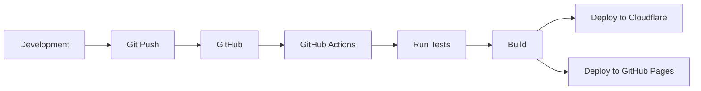

# Deployment Overview

Deploy your site to production with confidence.

## Deployment Options

This site supports multiple deployment platforms:

### Primary: Cloudflare Pages

**Best for:**

- Main production site
- Unlimited bandwidth
- Global edge network
- Free tier with generous limits

[Cloudflare Pages Guide ](cloudflare.md)

### Vercel (Alternative)

**Best for:**

- Alternative to Cloudflare
- Preview deployments
- Analytics

[Vercel Deployment Guide ](vercel.md)

### GitHub Pages

**Best for:**

- Documentation site
- MkDocs deployment
- Open source projects

[GitHub Pages Guide ](github-pages.md)

### Other Platforms

Also compatible with:

- Netlify
- AWS S3 + CloudFront
- Any static host

## Quick Deployment

### 1. Build Locally

```bash
npm run build
```

Output in `dist/` directory.

### 2. Test Production Build

```bash
npm run preview
```

Visit `http://localhost:4321` to verify.

### 3. Deploy

Choose your platform and follow the guide.

## Deployment Architecture



## Deployment Checklist

Before deploying:

- [ ] All tests passing
- [ ] Build completes successfully
- [ ] No TypeScript errors
- [ ] Lighthouse scores acceptable
- [ ] Dependencies up to date
- [ ] Environment variables configured

## Environment Variables

Required for deployment:

```bash
# Cloudflare Pages (configured in dashboard)
CLOUDFLARE_API_TOKEN=xxx
CLOUDFLARE_ACCOUNT_ID=xxx

# Optional: Vercel (if using as alternative)
VERCEL_TOKEN=xxx
```

## Deployment Workflow

### Automated Deployment

The CI/CD pipeline automatically handles deployments:

**CI Workflow** (runs on every push to main and PRs):

- Runs tests and builds
- Generates architecture documentation
- Uploads Lighthouse performance reports
- Builds docs on PRs to main and deploys to GitHub Pages from that workflow

**CD Workflow** (conditional deployment):

- **Deploys to Cloudflare Pages** only when source code changes
- **Skips deployment** for documentation-only changes (docs/, \*.md files)
- Can be triggered manually via workflow_dispatch

### Development

```bash
git checkout -b feature/my-feature
# Make changes
npm run build
npm run preview
git commit -m "feat: add my feature"
git push origin feature/my-feature
```

### Pull Request

- Automated checks run
- Tests and build validation
- Review and merge

### Production

```bash
git checkout main
git pull
# Automatic deployment (conditional based on changes)
```

### Deployment Triggers

**Cloudflare Pages deploys when:**

- Source files change (src/, components/, scripts/, config files)
- Manual workflow dispatch is triggered
- NOT when only docs/ or .md files change

**GitHub Pages deploys when:**

- PRs target `main` (docs build + deploy job)

## Rollback Strategy

### Cloudflare Pages

Use Cloudflare dashboard to rollback:

1. Go to Workers & Pages your project
2. Click on Deployments
3. Find last good deployment
4. Click "Rollback to this deployment"

### Git-based Rollback

Revert the commit that caused issues:

```bash
git revert <commit-hash>
git push origin main
```

## Monitoring

### Build Status

Check build status in:

- GitHub Actions
- Cloudflare Pages dashboard

### Site Health

Monitor:

- Cloudflare Web Analytics
- Core Web Vitals
- Error rates (Cloudflare dashboard)
- Traffic patterns
- Cache hit rates

## Deployment Frequency

Typical deployment schedule:

- **Features**: As completed
- **Fixes**: Immediately
- **Dependencies**: Weekly
- **Content**: As needed

## Next Steps

- [Cloudflare Pages Deployment](cloudflare.md) (Primary)
- [GitHub Pages Setup](github-pages.md) (Documentation)
- [Vercel Deployment](vercel.md) (Alternative)
- [Architecture Overview](../architecture/overview.md)
