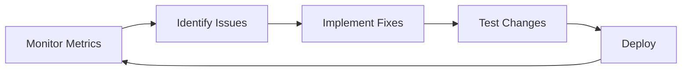

# Observability

Comprehensive monitoring, metrics, and logging for production visibility.

## Overview

This site uses Cloudflare's built-in observability features along with GitHub Actions for build-time monitoring. All monitoring is privacy-focused and doesn't require cookies or personal data collection.

## Cloudflare Web Analytics

### Setup (Edge Injection - Recommended)

Enable automatic analytics injection via Cloudflare dashboard:

1. **Navigate to Analytics**
   - Log into Cloudflare dashboard
   - Go to your domain
   - Click **Analytics & Logs** **Web Analytics**

2. **Enable Automatic Injection**
   - Click **Add a site**
   - Select **Automatic Setup**
   - Choose your site from the dropdown
   - Toggle **"Enable Web Analytics"**

3. **Verify Installation**
   - Deploy your site
   - Visit your site
   - Check browser DevTools Network tab
   - Look for `beacon.min.js` from `static.cloudflareinsights.com`

### What Gets Tracked

**Page Metrics:**

- Page views
- Unique visitors
- Bounce rate
- Time on page
- Exit pages

**Performance Metrics:**

- **LCP** (Largest Contentful Paint) - Load performance
- **FID** (First Input Delay) - Interactivity
- **CLS** (Cumulative Layout Shift) - Visual stability
- **TTFB** (Time to First Byte) - Server response time

**User Context:**

- Browser type and version
- Operating system
- Device type (mobile/desktop/tablet)
- Screen resolution
- Country/region (based on IP)

**Traffic Sources:**

- Referrer URLs
- Direct traffic
- Search engines
- Social media

### Privacy Features

**No cookies**
**No fingerprinting**
**No cross-site tracking**
**GDPR compliant**
**No personal data collection**

### Accessing Analytics

**Cloudflare Dashboard:**

```
https://dash.cloudflare.com
 Your Domain
 Analytics & Logs
 Web Analytics
```

**Key Reports:**

- **Traffic**: Real-time and historical page views
- **Performance**: Core Web Vitals breakdown
- **Geo**: Geographic distribution
- **Devices**: Browser and OS breakdown

## Application Performance Monitoring

### Build-Time Metrics

Tracked via GitHub Actions:

**Build Performance:**

```yaml
# Automatically tracked in CI
- Build duration
- Bundle sizes
- Lighthouse CI scores
- Test execution time
- Dependency installation time
```

**View Build Metrics:**

```
GitHub Repository
 Actions tab
 Select workflow run
 View job summaries
```

### Runtime Performance

**Cloudflare Pages Dashboard:**

1. **Navigate to Workers & Pages**
   - Go to Cloudflare dashboard
   - Click **Workers & Pages**
   - Select your project

2. **View Metrics**
   - **Requests**: Total requests over time
   - **Bandwidth**: Data transferred
   - **Errors**: 4xx/5xx response codes
   - **Build Analytics**: Deployment success/failure rates

**Available Metrics:**

- Requests per second
- Bandwidth usage
- Cache hit ratio
- Error rates (by status code)
- Geographic request distribution
- Deployment frequency

### Core Web Vitals Monitoring

**Real User Monitoring (RUM):**

Cloudflare Web Analytics automatically tracks:

| Metric   | Target  | What It Measures                         |
| -------- | ------- | ---------------------------------------- |
| **LCP**  | < 2.5s  | How fast main content loads              |
| **FID**  | < 100ms | How quickly page responds to interaction |
| **CLS**  | < 0.1   | Visual stability (no layout jumps)       |
| **TTFB** | < 800ms | Server response time                     |

**View Core Web Vitals:**

```
Cloudflare Dashboard
 Web Analytics
 Performance tab
 Core Web Vitals section
```

## Lighthouse CI Integration

Automated performance testing on every build:

### Local Testing

```bash
# Build the site
npm run build

# Run Lighthouse locally
npm run lighthouse
```

### CI/CD Integration

Lighthouse runs automatically on every push/PR via GitHub Actions:

```yaml
- name: Run Lighthouse CI
  run: npm run lighthouse
  continue-on-error: true

- name: Upload Lighthouse results
  uses: actions/upload-artifact@v4
  with:
    name: lighthouse-results
    path: .lighthouseci
```

**Accessing Results:**

1. Go to GitHub Actions workflow run
2. Scroll to **Artifacts** section
3. Download `lighthouse-results`
4. Open `.lighthouseci` folder for detailed reports

**Tracked Metrics:**

- Performance score
- Accessibility score
- Best Practices score
- SEO score
- Detailed diagnostics and opportunities

## Error Tracking

### Build Errors

**GitHub Actions:**

- Compilation errors
- Test failures
- Linting issues
- TypeScript errors

**Access Build Logs:**

```
GitHub Repository
 Actions
 Failed workflow run
 Job logs
```

### Runtime Errors

**Cloudflare Pages:**

**View Error Rates:**

```
Cloudflare Dashboard
 Workers & Pages
 Your Project
 Metrics
 Filter by 4xx/5xx status codes
```

**Error Types:**

- **4xx**: Client errors (404 not found, etc.)
- **5xx**: Server errors (extremely rare with static sites)

### 404 Monitoring

Track missing pages via Cloudflare Analytics:

1. Go to **Analytics & Logs**
2. Click **Traffic**
3. Filter by **Status Code: 404**
4. View most requested missing pages

## Deployment Monitoring

### GitHub Actions Status

**CI Pipeline:**

```
GitHub Repository
 Actions tab
 CI workflow
```

**Tracked:**

- Test results
- Build success/failure
- Lighthouse CI results
- Deployment status

**Status Badge:**

```markdown

```

### Cloudflare Pages Deployments

**View Deployment History:**

```
Cloudflare Dashboard
 Workers & Pages
 Your Project
 Deployments tab
```

**Deployment Metrics:**

- Build time
- Success/failure rate
- Deployment frequency
- Preview deployments

## Alerting

### GitHub Actions

**Email Notifications:**

- Enabled by default for workflow failures
- Configure in GitHub Settings Notifications

**Webhook Integration:**

```yaml
# .github/workflows/ci.yml
- name: Notify on failure
  if: failure()
  uses: actions/github-script@v6
  with:
    script: |
      // Custom notification logic
```

### Cloudflare Notifications

**Setup Alerts:**

1. **Navigate to Notifications**

   ```
   Cloudflare Dashboard
    Notifications
    Add
   ```

2. **Available Alerts:**
   - High error rate (5xx responses)
   - Traffic spike detection
   - DDoS attack mitigation
   - SSL certificate expiration
   - Build failures

3. **Notification Channels:**
   - Email
   - Webhooks
   - PagerDuty
   - Slack (via webhooks)

### Recommended Alerts

**Critical:**

- Build failures (GitHub Actions)
- 5xx error rate > 1%
- SSL certificate expiring < 30 days

**Warning:**

- Lighthouse performance score < 95
- 404 error spike (sudden increase)
- Build time > 5 minutes

## Custom Tracking

### Manual Event Tracking (Optional)

If you need to track custom events beyond page views:

**Client-Side Beacon API:**

```javascript
// Example: Track button clicks
document.querySelector('.btn-primary').addEventListener('click', () => {
  if (navigator.sendBeacon) {
    const data = JSON.stringify({
      event: 'button_click',
      label: 'contact_cta',
      timestamp: Date.now(),
    });
    navigator.sendBeacon('/api/events', data);
  }
});
```

**Note:** Requires Cloudflare Workers for custom endpoint.

### Server-Side Logging

**Cloudflare Logs (Enterprise Only):**

- Full HTTP request logs
- Real-time log streaming
- Integration with external tools (Datadog, Splunk, etc.)

**Free Tier Alternative:**

- Use Cloudflare Web Analytics
- Export data via GraphQL API (limited)

## Performance Budgets

### Lighthouse CI Budgets

Configured in `.lighthouserc.json`:

```json
{
  "ci": {
    "assert": {
      "assertions": {
        "categories:performance": ["warn", { "minScore": 0.95 }],
        "categories:accessibility": ["warn", { "minScore": 0.95 }],
        "categories:best-practices": ["warn", { "minScore": 0.95 }],
        "categories:seo": ["warn", { "minScore": 0.95 }]
      }
    }
  }
}
```

### Bundle Size Budgets

Monitor in CI:

```bash
# Check bundle size
npm run build
du -sh dist/
```

**Target Budgets:**
| Asset Type | Budget | Current |
|------------|--------|---------|
| HTML | 20kb | ~15kb |
| CSS | 30kb | ~25kb |
| JavaScript | 100kb | ~50kb |
| Total | 200kb | ~100kb |

## Data Retention

**Cloudflare Web Analytics:**

- Free tier: 90 days
- Pro plan: 1 year
- Enterprise: Custom retention

**GitHub Actions:**

- Workflow logs: 90 days
- Artifacts: 90 days (configurable)

**Lighthouse CI:**

- Stored in GitHub Artifacts (30 days as configured)
- Can be extended or exported to external storage

## Privacy & Compliance

### GDPR Compliance

**Cloudflare Web Analytics:**

- No cookies (no consent banner needed)
- No personal data collection
- Anonymous IP addresses
- No cross-site tracking

**What's NOT tracked:**

- Individual user identification
- Personal information
- Session IDs
- Cookies

### Data Export

**Export Analytics Data:**

Via Cloudflare API:

```bash
curl -X GET "https://api.cloudflare.com/client/v4/accounts/{account_id}/analytics/web" \
  -H "Authorization: Bearer {api_token}"
```

**Available Formats:**

- JSON (via API)
- CSV (via dashboard export)

## Dashboards

### Cloudflare Dashboard

**Quick Access:**

- Traffic overview
- Performance metrics
- Core Web Vitals
- Geographic distribution
- Top pages

### GitHub Insights

**Repository Analytics:**

```
GitHub Repository
 Insights tab
 Community
 Traffic
 Actions
```

**Available Data:**

- Repository clones
- Views and visitors
- Referring sites
- Popular content

## Debugging & Troubleshooting

### Performance Issues

**Check Cloudflare Analytics:**

1. Identify slow pages (high LCP/TTFB)
2. Check geographic distribution (CDN issues?)
3. Review device/browser breakdown

**Run Lighthouse:**

```bash
npm run lighthouse
```

**Review Diagnostics:**

- Render-blocking resources
- Unused JavaScript
- Image optimization opportunities

### High Error Rates

**Check Cloudflare Pages:**

1. View error breakdown by status code
2. Check recent deployments (did a bad deploy cause it?)
3. Review build logs for issues

**Rollback if Needed:**

```
Cloudflare Dashboard
 Workers & Pages
 Deployments
 Rollback to previous version
```

## Best Practices

### Regular Review

**Weekly:**

- Check Core Web Vitals trends
- Review top pages performance
- Monitor error rates

**Monthly:**

- Analyze traffic patterns
- Review bundle sizes
- Check Lighthouse scores
- Audit 404 errors

**Quarterly:**

- Performance budget review
- Analytics data export
- Alert configuration review

### Optimization Cycle



## Next Steps

- [Performance Optimization](performance.md)
- [Deployment Guide](../deployment/cloudflare.md)
- [Architecture Overview](../architecture/overview.md)
