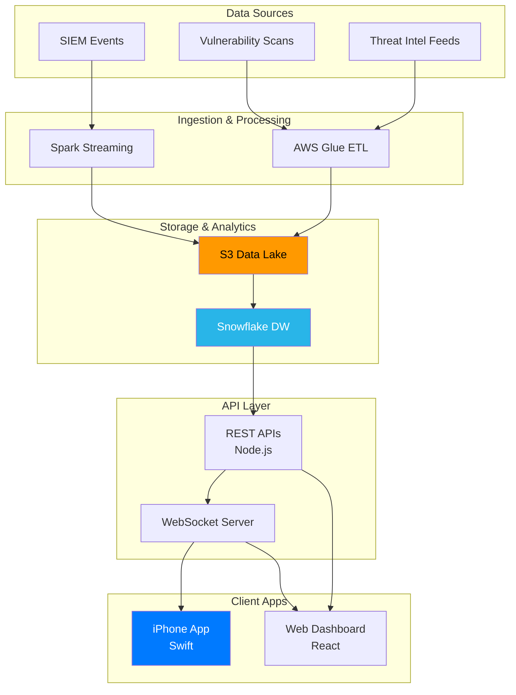

Built an end-to-end risk intelligence platform delivering real-time cyber threat visibility to executives on mobile and web.

Key achievements:
- Data pipeline processing millions of security events using Spark and AWS Glue
- Native iOS app with real-time alerts via WebSockets for instant risk notifications
- Interactive drill-down capabilities from executive summary to raw security events
- Unified data product with APIs serving both mobile and web applications

## Architecture

The system uses a multi-tier data pipeline with real-time and batch processing:

*Architecture diagram lives in codebase at `docs/architecture/cyber-risk-platform.mmd` and auto-deploys with every change.*
